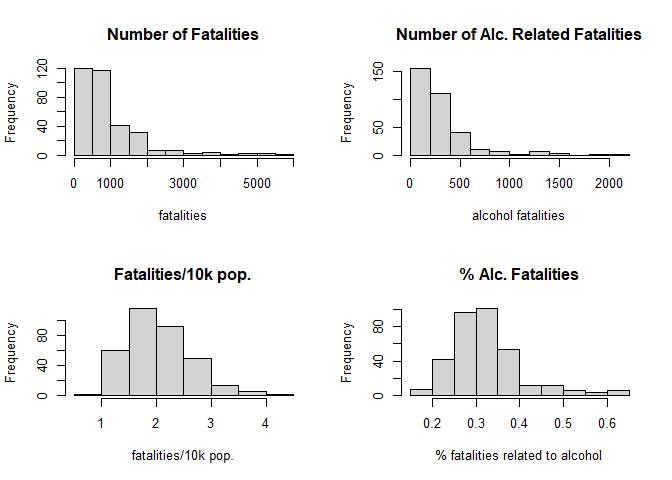

Abstract
========

Alcohol has been known to affect drivers' perception, alertness,
awareness, acuity, and response time, all of which are related to
driving ability. \[17\] The objective of this project is to build a
predictive model that uses the variables: mandatory jail sentence,
mandatory community service, tax on case of beer, minimum drinking age,
percent residing in dry counties, unemployment, spirits consumption, and
preliminary breath test law to estimate the percent of alcoholic
fatalities (alcoholic fatalities/total fatalities). The data for this
project comes from the National Highway Traffic Safety Administration's
Fatal Accident Reporting System (FARS). \[1\] The data was taken across
48 states (excluding Alaska, Hawaii, and District of Columbia) for seven
years (1982-1988). The exploratory data analysis indicated that with the
exception of percentage of dry counties, the percentage of alcoholic
fatalities seemed to have a decreasing trend for all other variables.
Panel regression analysis using the fixed effect model was found to be
the most appropriate in predicting percent of alcoholic fatalities with
significance found for spirits consumption, mandatory jail sentence, and
mandatory community service. However, the model also showed cross
sectional dependence indicating a lack of independence between states
for the outcome variable. The findings indicate that state and local
governments need to create and enforce stricter laws on drunk driving.

Introduction
============

Traffic fatalites are a major cause of death in the United States,
especially a leading cause of death in the first three decades of life
\[1\]. Alcohol is involved in almost one third of the traffic fatalities
nationwide. In 2016, 10,497 people died in alcohol-impaired driving
crashes, accounting 28% of traffic fatalities in US \[2\]. It has been
shown that a variety of individual skills would be impaired with a blood
alcohol concentration (BAC) level well below 0.05%, and the risk of
crashes increased exponentially \[3\].

From 1980s to 2010s, the deaths resulting from motorvehicle collisions
declined by nearly 35% \[4\]. It coincided with the period of time
(1980-1985) when many states made considerable amount of legislative
reforms in order to reduce drunken driving and fatal automobile crashes:
increasing minimum drinking age to 21, adopting criminal and
administrative per se laws, and instituting penalty increases for
drunken driving \[5\]. Many previous studies had shown that the adoption
of alcohol regulations and alcohol-impaired driving laws could reduce
fatal car crashes: defining BAC limits for drivers at 0.08 or lower
\[6\]; minumum drinking age (21) laws and zero-tolerance laws dor
younger drivers \[7\], fines and jail sentences for alcohol-impaired
driving \[8\].

Although given these evidence for the effectiveness of adopting alcohol
regulations and drunken driving punishment laws on reducing
alcohol-related traffic fatalities, the traffic policy enviornment in
diffrent states often varied a lot, and many socioecnomic factors that
can potentially impact alcohol-involved traffic fatalies are not
consistent across states. Therefore, the objective of the current
project is to investigate *the effect of alcohol regulation and
alcohol-impaired driving laws on the proportion of alcohol-involved
fatalities among all traffic fatalities, controlling for state-specific
unobservable confounders*.

Background
==========

The data for this project comes from a study in the Journal of Health
Economics. Alcohol related traffic incidents are not anything new. In
1996, a study looked into vehicle fatalities from 1982 to 1988. The data
was obtained from the National Highway Traffic Safety Administration's
Fatal Accident Reporting System (FARS). \[1\] They conducted a
population-based study that observed traffic fatalities from 48 states
(excludes Alaska, Hawaii, and District of Columbia) over 7 years. There
were 336 observations on 34 different variables, however California had
missing values in the year 1988 so that observation was omitted leading
to 335 observations. The reason this study is important is that these
were the last years that states had differing minimum drinking ages.
After 1988, the drinking age increased to 21 years old throughout the
United States. The predictor variables that were examined in the study
were state, year, spirits consumption, unemployment rate, per capita
personal income, employment//population ratio, tax on a case of beer,
percent of people who were Southern Baptist, percent of people who were
Mormon, the minimum legal drinking age, percent residing in "dry"
counties, percent of drivers aged 15-24, average miles per driver,
whether the state had a mandatory jail sentence, whether the state had
mandatory community service, the population of each state, the
population of 15 to 17 year old people in each state, the population of
18 to 20 year old people in each state, the population of 21 to 24 year
old people in each state, the total vehicle miles (millions), the US
employment rate, the US employment/population ratio, and GSP rate of
charge. The response variables were number of fatalities, number of
nighttime fatalities, number of single fatalities, fatalities among 15-
to 17-year-old individuals, fatalities among 18- to 20-year-old
individuals, fatalities among 21- to 24-year-old individuals, and
alcoholic related fatalities. The study also examined the nighttime
fatalities involving the three different age groups (15-17; 18-20;
21-24). \[14\]The objective of this project is to build a predictive
model from the data that predicts the percentage of vehicle fatalities
that are alcohol related. The predictor variables that are being
considered are alcohol related. They are jail, service, tax on beer
(beertax), minimum drinking age (drinkage), percent residing in dry
counties (dry), and preliminary breath test law (breath). However, after
some further research it was found that unemployment is also positively
correlated with alcohol misuse, so unemployment was added as a variable
as well.\[15\] The response variables will be proportion of alcoholic
fatalities (alcoholic fatalities over total fatalities). These variables
identified in the data set are afatal (number of alcohol-involved
vehicle fatalities), pop (population), state (factor indicating state),
year (factor indicating year), spirits (spirits consumption), beertax
(tax on case of beer), drinkage (minimum legal drinking age), dry
(percent residing in "dry" counties), unemp (unemployment rate), jail
(mandatory jail sentence), service (mandatory community service), and
breath (preliminary breath test law). The unit of analysis was each
state for each year, so the variables state and year were included from
the data set. According to a 2017 study by WalletHub there were
significant difference in strict DUI and DWI laws in the 50 states and
the District of Columbia. States with the strictest laws were Arizona,
Georgia, Alaska, Kansas, and Oklahoma meanwhile the states with the most
lenient laws were Idaho, North Dakota, Ohio, District of Columbia, and
South Dakota. \[17\] This means that states could be a factor in
proportion of alcoholic fatalities. The data was accessed using the AER
package in R.

Descriptive analysis
====================

Overview
--------

In response to the goal of this analysis, there are various metrics that
one can use to understand the severity of alcohol-related vehicle
fatalities throughout the USome of which include the number of
alcohol-related fatalities per state, or the rate of alcohol-related
fatalities per 10k people, or even the ratio between alcohol-related
fatalities with overall fatalities. Each metric will produce different
results and different interpretation.

To get a good sense on how the type of metric can affect the
interpretation of the outcome, we observe the map below, which plots
each state in the USA with different shades of purple to signify the
different mean proportion of alcohol-related fatalities by state. As we
hover over the following map, we can see that California (CA) has one of
the largest number of alcohol-related fatalities in the country
(averaging more than 5000 deaths per year), yet its rate of
alcohol-related fatalities per 10k people of 1.9 is almost half of that
of Texas (TX) (3.6 alcohol-related fatalities per 10k people). On the
other hand, if we were to compare the ratio of alcohol-related
fatalities to overall fatalities, both California (0.26) and Texas'
(0.41) statistics were far below that of Mississippi's (0.52).

These differences show the importance of choosing the suitable metric
for the purpose of this data analysis. The choice of metric will be
discussed in Section 4.2.1.2.

Exploratory Data Analysis
-------------------------

As the focus of this data analysis is to find out whether laws that were
implemented to tackle drunk driving related fatalities, only a subset of
the variables from the `Fatalities` dataset were used. In particular,
response variables that were alcohol-related such as the total number of
fatalities and alcohol fatalies were examined, while predictor variables
that are closely related to alcohol-consumption-driven laws were also
analyzed.

### Univariate Analysis

We start off the exploratory data analysis procedure by individually
examining the predictor and response variables. The goal here is to
understand how the data is distributed, which helps set an expectation
on how the variables correlate with each other, or whether certain model
assumptions will be met.

#### Predictor Variables

As we look into how alcohol consumption driven laws impact the rate of
alcohol-related fatalities, some variables of interest include spirit
consumptions, beer tax, proportion of the population living in dry
counties, minimum drinking age, and the mandatory punishments
implemented by each state throughout the 7 years.

The plot below shows the top 5 states in terms of average spirits
consumptions, average beer tax, and average proportion of population
living in dry counties between 1982 and 1988. Other than North Carolina
(NC) being in the top 5 states for beer tax and containing large
proportion of dry residents, it can be seen that there is no other
"standout" state below, ie. there's no state present in more than one of
the top 5 categories.

On the other hand, it can be seen that there has been an increasing
implementation/tightening of laws throughout the 7 years. The most
obvious changes here is the number of states that increased the minimum
drinking age. In 1982, almost half the country had set their minimum
drinking age to be less than 21, and yet most of the states have opted
for 21 to be the minimum drinkage 7 years later.

Additionally, there seem to be a slight increasing trend in the number
of states that implement testings (breath test) and punishments
(mandatory jail sentence and mandatory community services) between 1982
and 1988. We need to note, however, that the number of states
implementing mandatory jail sentences decreased very slightly from 1986
to 1988. This raises the question of whether a mandatory jail sentence
is effective in combating the issue of drunk driving. Such questions
will be addressed after fitting a suitable model.

#### Response Variables

After observing the trend of the implemented laws, the focus is now
switched to analyzing the distribution of fatalities and alcohol
fatalities across the country. A quick look at the top two histograms
below might suggest that a large portion of states have less than 1000
fatalities per year, and less than 500 alcohol related fatalities per
year. However, each state's population need to be taken into account in
this case due to the significant variation in population sizes across
the country. Our new histograms (bottom two) tell us that the
distributions of the data can be approximated as normal.

Since the goal of this analysis is to discuss the effects of
alcohal-related law implementations, the alcohol-related fatalities
becomes our main topic of interest. There are a number of approaches in
determining the best metric for observing such specific fatalities,
among which is the number of alcohol related fatalities per 10k people.
However, the issue with such a metric is that it does not tell a good
story on whether the implemented traffic policies had success in
reducing the number of alcohol-related fatalities. Other factors could
have come into play which resulted in a lower overall fatality rate in
general, which in turn affects the alcohol-related fatalities rate.

In this analysis, the metric used for analyzing the effect of traffic
laws on alcohol-related fatalities is the proportion of alcohol-related
fatalities among the overall fatalities by state and year, ie. $$
p = \frac{\text{Number of alcohol-related fatalities}}{\text{Number of overall fatalities}}
$$ An advantage of this metric for the purpose of this data analysis is
its robustness to the changes in overall fatalities. In other words, $p$
is still able to give us useful and unbiased information on
alcohol-related fatalities in response to the changes in overall
fatalities in certain states or years.

The plot below shows the proportion of alcohol-related fatalities of
each state throughout the years. It can be seen that the proportion of
alcohol-related fatalities have been either constant or decreasing in
those 7 years. This is more prevalent in states such as Kansas (KS),
North Dakota (ND), and Arkansas(AR). However, there is one exception to
this trend. In the line plot below, we observe that Mississipi had a
significant increase in the proportion of alcohol fatalities from 1983
to 1988. 

### Multivariate Analysis

In this section, we will observe the pairwise interaction between the
predictor and response variables. The first thing that was done was to
examine the correlation between each pair of continuous predictor
variables. In the scatterplot matrix below, it is obvious that there
were no distinct patterns between the predictor variables throughout all
years, which suggest low correlation between all pairs of continuous
predictors. 

Another thing we want to ensure prior to fitting any models in this
analysis is the non-presence of the variance inflation factor (VIF). The
VIF of the $k$th predictor, denoted as $VIF_k$, is defined as 
$$
VIF_k = \frac{1}{1-R_k^2}
$$ 
where $R_k^2$ is the coefficient of multiple determination when the
predictor variable $X_k$ is regressed onto the rest of the $X$
variables. Intuitively, a large $VIF_k$ value means that the predictor
$X_k$ can be well explained by the other $X$ variables, which would
ultimately lead to the multicollinearity phenomenon. Notice that
$R_k^2 \geq 0$, and therefore $VIF_k \geq 1$. This means that we want to
obtain $VIF$ values that are as small as possible and as close to 1 as
possible to prevent multicollinearity. In this dataset, we see that all
the $VIF_k$ values are considerably close to 1, signifying that
multicollinearity is not an issue in this data set.

With the predictor variables analyzed, we now proceed to the pairwise
interactions between those predictor variables and the proportion of
alcohol-related fatalities. In the series of boxplots below, we gain
some insights that one would generally expect:

-   The proportion of alcohol-related fatalities show a decreasing trend
    troughout the years. ` `{=html}
-   The proportion of alcohol-related fatalities is slightly lower when
    a mandatory community service is being implemented. ` `{=html}
-   The proportion of alcohol-related fatalities is slightly lower when
    a preliminary breath test is being implemented. ` `{=html}
-   The proportion of alcohol-related fatalities decreases as the
    minimum drinking age increases. However, note that the boxplot of
    alcohol-related fatalities when the minimum drinking age is 21 has a
    significantly larger variance.

On the other hand, an interesting finding from these boxplots that
mandatory jail sentences somehow correlate with a larger proportion of
alcohol-related fatalities. This unexpected finding could also be the
reason that the number of states implementing such policy decreased
between 1986 and 1988, as shown in the previous section.

After observing the change in proportion of alcohol-related fatalities
in response to categorical variables and time, we then aim to do the
same with the continuous predictor variables. In the interactive scatter
plots below, each data point is colored by its implementation of the
madatory jail sentence due to the unexpected findings from previous
sections. While no concrete conclusions can be made in that regard, it
can be seen that the data points in all four plots converge to the
bottom left corner as the years go by. This tells us that:

-   The proportion of alcohol-related fatalities have decreased over the
    years, except for Mississippi. After the year 1985, the proportion
    of alcohol-related fatalities kept on increasing, while the
    proportion for other states have continuously decreased. By 1987 and
    1988, Mississippi was the outlier in this data. ` `{=html}
-   With the exception of the proportion of dry residents, the beer tax,
    unemployment rate, and spirits consumption generally observed a
    decreasing trend for all states throughout the 7 years.

Based on what we have seen so far, it does seem as if these policies did
gain a positive effect in the long run. Even if the decreasing amount of
beer tax resulting in a decreased proportion of alcohol-related
fatalities seemed non-intuitive, it could be due to the fact that there
is a time-lag/latency element to consider where people take time to
adjust to high beer taxes before tending to lower alcohol purchase and
intake, which ultimately results in lower alcohol-related fatalities.

Lastly, we turn to analyzing the distribution of young drivers (aged
between 15-24) throughout the years. While this may not be directly
correlated with the current data analysis, it would be interesting to
see if the change in the minimum drinking age has any effect on the
distribution of young drivers. As expected, with the increase in the
minimum drinking age, the proportion of young drivers decreased. This
could be due to the decrease in proportion of legal young drivers, which
in turn correlates with the decreasing proportion of alcohol related
fatalities (shown in scatterplots on the right).

With all of those in mind, we can then move on to fitting an appropriate
model and produce some causal inference for this data.

Inferential analysis
====================

As we noticed, this data set is panel data, having several repeated
measures (6 for CA and 7 for else) for each state. Thus, we want to use
fixed effects representing the state-specific means, and a fixed-effect
model was fitted. Since it is a question-driven analysis based on
p-values and variables of interest, eventually, we included five
predictors in our final model: spirits consumption, minimum legal
drinking age, preliminary breath test law, mandatory jail sentence, and
mandatory community service.

One-way individual fixed effect model
-------------------------------------

$$
Y_{it}=\alpha_i+\beta_1 X_{it,1}+\beta_2 X_{it,2}+\beta_3 X_{it,3}+\beta_4 X_{it,4}+\beta_5 X_{it,5}++\beta_6 X_{it,6}+\beta_7 X_{it,7}+\epsilon_{it}
$$

### Parameter notation:

-   $i=1,2\dots,48$: state index; $t=1,2,\dots,6,7.$: time index.

-   $Y_{it}$: ratio of number of alcohol-involved vehicle fatalities to
    overall vehicle fatalities for state $i$ and year $t$.

-   $Y_{it}=\frac{\text{Number of alcohol involved vehicle fatalities}_{it}}{\text{Number of vehicle fatalities}_{it}}$.

-   $\alpha_i$: State-specific parameter (unobserved time-invariant
    individual effect) for state $i$.

-   $\beta_1,\beta_2,\beta_3,\beta_4,\beta_5,\beta_6,\beta_7$:
    represents for coefficients of spirits, drink-age 19, drink-age 20,
    drink-age 21, jail, service, breath, respectively.

-   $X_{it,1}$: is a continuous variable;
    $X_{it,2},X_{it,3},X_{it,4},X_{it,5},X_{it,6},X_{it,7}$ are dummy
    variables.

Note: Since we dropped one observation with missing values (CA 1988), we
have an unbalanced panel.

### Assumptions:

(1) Conditional relationship of $Y_{it}$ given
    {$X_{it,1},\dots, X_{it,7}$} is linear in the explanatory variables.

(2) $\epsilon_{it}$ are independent random variables with zero mean and
    constant variance:
    $$E(\epsilon_{it})=0,\  Var(\epsilon_{it})=\sigma^2$$

### Model justification

-   Test for heterogeneity: To know whether the intercepts for each
    state are equal or not, an F test for individual effects was
    conducted.
    $$H_0:\alpha_1=\dots=\alpha_{48} \text{ vs. } H_A: \text{ not all } \alpha_i \text{ are equal}$$
    P-value $< 2.2e-16$ indicates rejecting the null hypothesis, which
    corresponds to our intuition of using fixed effects rather than
    ordinary least squares.

-   Test for fixed effect over random effect model: To decide between
    fixed and random effects, we used the Hausman test:
    $$H_0: \text{ Random effects vs. } H_A: \text{ Fixed effects.}$$
    P-value $< 2.2e-16$ means fixed effects model is more appropriate.

-   Test for time-fixed effects:
    $$H_0: \text{ need time-fixed effects vs. } H_A:  \text{ no need for time-fixed effects}$$
    Both F-test for individuals effects (p-value=0.015) and Lagrange
    Multiplier test (p-value=0.001) show no need to use time-fixed
    effects.

Sensitivity analysis
====================

-   Testing for cross-sectional dependence: Though, in our case, we have
    micro panels with few years and a large number of subject/states,
    whether residuals across entities are correlated or not was tested
    cautiously. Unfortunately, both Breusch-Pagan LM test and Pesaran CD
    test show cross-sectional dependence. Hence, the assumption
    regarding independent subjects is violated. Potential reasons and
    consequences of this dependence will be discussed in the discussion
    section.

-   Testing for unit roots: Since the Augmented Dickey-Fuller test
    (p-value \<0.01) indicates no unit roots present, no further
    transformation of variables is needed.

-   Test for multicollinearity: Since VIF scores are relatively small
    (the biggest one is 6 - drinking age 21), we concluded there is no
    multicollinearity issue.

-   Test for homoscedasticity: Based on the below residuals plots, the
    smooth curve for residual is relatively identical to the x-axis;
    thus, we conclude that the homoscedasticity assumption holds.

-   Test for normality: From the QQ plots of two residuals, we can see
    slight heavy tails at left and right tails. But, we think it only
    shows a slight deviance from normality and concluded the residuals
    are normal distributed.

-   Test for outliers: From the leverage plot, we can see no there are
    no specious leverage values. Hence, we concluded no large outliers.

Causal interpretation
=====================

Based on the final model, three factors were significant in explaining
the change in alcohol-related fatalities ration: spirits consumption,
mandatory jail sentence, and mandatory community service for
driving-under-influence, after controlling for preliminary breath test
law, and minimum drinking age. The assumptions needed for causal
inference, problems with current model, and possible solutions were
discussed here.

In panel data, measures were conducted on the same entity (state)
repeatedly at different time points (years). The fixed effect model
adopted in the current project accounted for unobserved,
entity-specific, time-invariant confounders. Given these features, this
model controlled for the effect of some unmeasured or un-measurable
factors that differed across states on alcohol fatalities ratio.
Therefore, if no model assumptions were violated, then we should be able
to make causal inference on the significant factors within each state.
Our model essentially explained how the change in the response variable
overtime specific to a state ($Y_{it}-\bar{Y}_i$), could be explained by
the change in predictors of that state ($X_{it}-\bar{X}_i$).

However, the model diagnosis result showed that our model had
cross-sectional dependence, which is a violation of the model assumption
that states should be independent of each other. Although each state had
their own legislative system, the federal law can still largely affect
state laws by witholding or providing funding to encurage the passage of
a law. For example, in 1984, federal legislation prompted all 50 states
to adopt the 21 minimum legal drinking age law by 1988 \[9\]. Thus under
the same big policy environment, it is unlikely that each state's
legislation were uncorrelated. Because the model adopted in the current
project assumed independent entities, violation of such assumption might
lead to bias in our results that invalidate causal inference.

Besides the original model assumptions, the fixed effect model also
requires strong exogeneity in order to make causal inference, including:
(a) no unobserved time-varying confounders; (b) past outcomes do not
directly affect current outcome; (c) past treatments do not directly
affet current outcome; (d) past outcome do not directly affect current
treatment (reverse causation) \[10\]. Assumption (a) is hard to verify
and also difficult to relax under the fixed effect model. Thus we
assumed no time-varying covariates were omitted from the current model
and see whether the other assumptions were violated in the current model
and how they can be relaxed.

Assumption (b) can be relaxed without interfering with the causal
inference between current treatment and current outcome so long as we
condition on past treatment, and assuming past outcome does no directly
affect current treatment. For assumption (c), it is highly likely that
our model did not conform to this assumption. It is natural for laws and
regulations to have a lagged effect: the laws passed this year might not
have an effect until the next. To relax assumption (c), we could add a
small number of lagged treatment effect into the model (e.g. treatment
from the year before) for the "breath","jail", and "service" predictors.
Last, for assumption (d): no reverse causation, a popular approach to
relax it is to include instrumental variables for endogenous predictors.
Endogenous predictors are those included in the model but are correlated
with the error term. This could happen when the response variable can
reversely cause the predictor, or some omitted confounders can affect
both dependent and independent variables. Instrumental variables were
those not included in the model, associated with the endogenous
predictor, but not associated with the unobserved confounders.

The factor of concern for violation of assumption (d) is spirits
consumption. Some previous studies on the traffic policy environment and
fatality rate suggested using alcohol regulations as instrumental
variables for alcohol consumption when investigating the effect of
alcohol consumption on traffic accidents fatality. Such alcohol
regulations can only affect traffic accident fatality through alcohol
consumption, and there were previous studies showing significant effect
of such regulations on alcohol consumption. In the current dataset, the
covariate related to alcohol consumption is "spirits", and alcohol
regulations include "drinkage" (minimum drinking age), and "beertax". To
verify the approporiateness of drinkage and beertax as instrumental
variables for spirits consumption, under-identification, weak
instrument, and over-identification need to be tested. To test for
under-identification is to test the null hypothesis that spirits and
beertax or drink age are irrelevant. This could be done through simple
t-test and likelihood ratio test. The result showed that beertax was not
associated with spirits consumption (Pr(\>F) = 0.1012), but drinkage had
significant effect (Pr(\>F) \<0.0001). Thus, beertax failed the
under-idetification test. Weak instrument was tested by calculating
Cragg-Donald F statistic and comparing it against Stock and Yogo
critical values. The null hypothesis (the instrumental variables are
weak) can be rejected if the Crgg-Donald F statistic is greater than the
criticla value. The Cragg-Donald F statistic calculated for drinkage was
10.59, and the critical value was 22.3, thus we failed to reject the
null at significance level 0.05. As a result, we could not find
appropriate instrumental variables for spirits in the current dataset.
If more measures are availble, such as other alcohol regulations and
other alcohol consumption information, we might be able to find more
suitable instrument variables.

Discussion
==========

In this project the objective is to use Panel regression analysis to
build a fixed effect model to find if there are associations between
percentage of alcohol related vehicle fatalities and relevant covariates
like drinking age, spirits consumption, unemployment, tax on case of
beer, as well as laws related to mandatory breath test, mandatory jail
sentence, and mandatory community service. The data for this project was
taken from the National Highway Traffic Safety Administration's Fatal
Accident Reporting System (FARS) collected over 7 years from 1982-1988.
The data reported vehicular fatalities which was further partitioned
into percentage of alcohol and non-alcohol related fatalities grouped by
state. Therefore, the basic unit of analysis is at the state level for
48 states excluding Alaska, Hawaii, and the District of Columbia giving
us 336 observations. States with missing values were dropped from
analysis resulting in 335 observations. The boxplot of average fatality
percentage vs Year (1982 to 1988) suggests a linear decline for all
states except Mississippi. There also appears to be a downward trend for
most covariates (beer tax, unemployment rate, spirits consumption and
drinking age) measured at the seven timepoints except for the covariate
percent of dry counties. Panel regression analysis was used to build a
predictive model with the response variable being the ratio of alcoholic
fatalities to total fatalities measured at seven time points. The
covariates included time variant variables also measured at the same
seven timepoints. Multiple models were considered to find the best model
for the outcome variable. The models that were considered for the
analysis were the fixed effects model, an ordinary least squares model,
a random effects model, and a time variant model. Multiple tests like
the F-test, Hausman test, and Lagrange Multiplier Test were used in the
selection of the best model. Based on these analyses it was concluded
that the fixed effects model was the best at predicting alcohol fatality
percentage. The inferential analysis findings were that spirits
consumption and had statistically significant positive associations with
percent of alcohol fatalities, and mandatory community service showed
negative association. This is in line with previous studies that have
shown drop in alcohol related vehicular fatalities with less alcohol
consumption and more stringent laws pertaining to DUI and DWI related
incidences. \[17\] Mandatory jail sentence had a statistically
significant positive association with the percentage of alcohol related
vehicle fatalities, which indicated that adoption of mandatory jail
sentence for DUI was associated with higher percentage of
alcohol-involved traffic fatality. Such counter-intuitive result
possible indicated the effect of an interaction with mandatory jail
sentence and another covariates, or a reverse causation between
mandatory jail and alcohol-fatalities: due to the high alcohol-related
traffic fatality rate, the states passed stricter laws on DUI or DWI.
More research is needed to explain such association. The project has
some limitations that should be addressed in future research. The first
caveat of this analysis is that the Breusch-Pagan LM test and Pesaran CD
test show cross-sectional dependence, indicating that the alcohol
fatality percentages were not independent of each other across states
which could potentially lead to type 1 error inflation. Future research
should focus on individual level fatalities, rather than grouped data,
using state as a potential clustering variable. The objective of the
project was to see changes in alcohol related fatalities over the course
of 7 years as a function of mandatory jail sentence and spirits
consumption. However, the analysis did not consider the effect of
confounders like improvement in technology, and stricter laws such as
seatbelts, airbags, and crumple points all of which have been shown to
reduce vehicle fatalities. Future research should control for these
confounders. Further, the use of prescription and non-prescription drugs
are also known to lead to higher incidences of vehicle fatalities but
were not considered as part of the analysis. In conclusion, alcohol can
affect drivers' cognition, vigilance, attention, judgment, and reaction,
all of which are related to driving ability. \[17\] Stricter laws like
mandatory jail time as well as reducing spirit consumption are
positively associated with reduced vehicular fatalities and states and
local governments need to work on improving and enforcing such laws.

Acknowledgement {#acknowledgement .unnumbered}
===============

Working codes can be found at:
<https://github.com/zengfung/TrafficFatalityAnalysis.git>.

Reference {#reference .unnumbered}
=========

\[1\] National Center for Health Statistics (US. (2011). Health, United
States, 2010: With special feature on death and dying. ` `{=html}
\[2\] Facts, T. S. (2012). Alcohol-Impaired Driving. DOT HS, 811, 630.
` `{=html} \[3\] Desapriya, E. B., Iwase, N., & TAYE, B. N. (2002).
Alcohol related traffic safety legislation: Where do we stand today?.
IATSS research, 26(2), 76-84. ` `{=html} \[4\] National Highway
Traffic Safety Administration. Fatality Analysis Reporting System
(FARS). Washington, DC: cited 2013 March; Available from:
<http://www.nhtsa.gov/FARS> ` `{=html} \[5\] Hingson, R. W., Howland,
J., & Levenson, S. (1988). Effects of legislative reform to reduce
drunken driving and alcohol-related traffic fatalities. Public Health
Reports, 103(6), 659. ` `{=html} \[6\] Wagenaar, A. C.,
Maldonado-Molina, M. M., Ma, L., Tobler, A. L., & Komro, K. A. (2007).
Effects of legal BAC limits on fatal crash involvement: analyses of 28
states from 1976 through 2002. Journal of safety research, 38(5),
493-499. ` `{=html} \[7\] Voas, R. B., Tippetts, A. S., & Fell, J. C.
(2003). Assessing the effectiveness of minimum legal drinking age and
zero tolerance laws in the United States. Accident Analysis &
Prevention, 35(4), 579-587. ` `{=html} \[8\] Wagenaar, A. C.,
Maldonado-Molina, M. M., Erickson, D. J., Ma, L., Tobler, A. L., &
Komro, K. A. (2007). General deterrence effects of US statutory DUI fine
and jail penalties: long-term follow-up in 32 states. Accident Analysis
& Prevention, 39(5), 982-994. ` `{=html} \[9\] Silver, D., Macinko,
J., Bae, J. Y., Jimenez, G., & Paul, M. (2013). Variation in US traffic
safety policy environments and motor vehicle fatalities 1980--2010.
Public health, 127(12), 1117-1125. ` `{=html} \[10\] Imai, K., & Kim,
I. S. (2019). When should we use unit fixed effects regression models
for causal inference with longitudinal data?. American Journal of
Political Science, 63(2), 467-490. ` `{=html} \[11\] Edward W. Frees.
(2004). Longitudinal and Panel Data: Analysis and Applications for the
Social Sciences. ` `{=html} \[12\] Oscar Torres-Reyna. (2010).
Getting started in Fixed/Random Effects Models using R. ` `{=html}
\[13\] K. Arthur Endsley. (2019). Implementing fixed effects panel
models in R. ` `{=html} \[14\] Ruhm, C. (1996). Alcohol Policies and
Highway Vehicle Fatalities. Journal of Health Economics 15(4): 435-454.
` `{=html} \[15\] Popovici I, French MT. Does Unemployment Lead to
Greater Alcohol Consumption?. Ind Relat (Berkeley). 2013;52(2):444-466.
<doi:10.1111/irel.12019> ` `{=html} \[16\] Comoreanu, A. (2017,
August 10). Strictest and most lenient states on dui. Retrieved February
12, 2021, from <https://wallethub.com/edu/dui-penalties-by-state/13549>
` `{=html} \[17\] E. Chamberlain and R. Solomon, "The case pfor a
0.05% criminal law blood alcohol concentration limit for driving,"
Injury Prevention, vol. 8, supplement 3, pp. iii1--iii17, 200
` `{=html}

Session info {#session-info .unnumbered}
============

    ## R version 4.0.3 (2020-10-10)
    ## Platform: x86_64-w64-mingw32/x64 (64-bit)
    ## Running under: Windows 10 x64 (build 19042)
    ## 
    ## Matrix products: default
    ## 
    ## locale:
    ## [1] LC_COLLATE=English_United States.1252 
    ## [2] LC_CTYPE=English_United States.1252   
    ## [3] LC_MONETARY=English_United States.1252
    ## [4] LC_NUMERIC=C                          
    ## [5] LC_TIME=English_United States.1252    
    ## 
    ## attached base packages:
    ## [1] grid      stats     graphics  grDevices utils     datasets  methods  
    ## [8] base     
    ## 
    ## other attached packages:
    ##  [1] faraway_1.0.7   tseries_0.10-48 MASS_7.3-53     plm_2.4-0      
    ##  [5] gplots_3.1.1    panelr_0.7.5    lme4_1.1-25     Matrix_1.2-18  
    ##  [9] GGally_2.0.0    forcats_0.5.0   stringr_1.4.0   dplyr_1.0.2    
    ## [13] purrr_0.3.4     readr_1.4.0     tidyr_1.1.2     tibble_3.0.4   
    ## [17] tidyverse_1.3.0 plotly_4.9.2.1  ggplot2_3.3.2   AER_1.2-9      
    ## [21] survival_3.2-7  sandwich_3.0-0  lmtest_0.9-38   zoo_1.8-8      
    ## [25] car_3.0-10      carData_3.0-4  
    ## 
    ## loaded via a namespace (and not attached):
    ##  [1] minqa_1.2.4        colorspace_2.0-0   ggsignif_0.6.0     ellipsis_0.3.1    
    ##  [5] rio_0.5.16         fs_1.5.0           rstudioapi_0.13    ggpubr_0.4.0      
    ##  [9] farver_2.0.3       fansi_0.4.2        lubridate_1.7.9.2  xml2_1.3.2        
    ## [13] splines_4.0.3      knitr_1.30         Formula_1.2-4      jsonlite_1.7.1    
    ## [17] nloptr_1.2.2.2     broom_0.7.2        dbplyr_2.0.0       compiler_4.0.3    
    ## [21] httr_1.4.2         backports_1.2.0    assertthat_0.2.1   lazyeval_0.2.2    
    ## [25] cli_2.2.0          htmltools_0.5.0    tools_4.0.3        gtable_0.3.0      
    ## [29] glue_1.4.2         Rcpp_1.0.5         cellranger_1.1.0   vctrs_0.3.5       
    ## [33] nlme_3.1-150       crosstalk_1.1.0.1  gbRd_0.4-11        xfun_0.19         
    ## [37] rbibutils_2.0      ps_1.4.0           openxlsx_4.2.3     rvest_0.3.6       
    ## [41] lifecycle_0.2.0    gtools_3.8.2       statmod_1.4.35     rstatix_0.6.0     
    ## [45] scales_1.1.1       miscTools_0.6-26   hms_0.5.3          RColorBrewer_1.1-2
    ## [49] quantmod_0.4.18    yaml_2.2.1         curl_4.3           gridExtra_2.3     
    ## [53] pander_0.6.3       bdsmatrix_1.3-4    reshape_0.8.8      stringi_1.5.3     
    ## [57] TTR_0.24.2         caTools_1.18.0     boot_1.3-25        zip_2.1.1         
    ## [61] Rdpack_2.1         rlang_0.4.8        pkgconfig_2.0.3    bitops_1.0-6      
    ## [65] evaluate_0.14      lattice_0.20-41    htmlwidgets_1.5.2  labeling_0.4.2    
    ## [69] cowplot_1.1.0      processx_3.4.4     tidyselect_1.1.0   plyr_1.8.6        
    ## [73] magrittr_2.0.1     R6_2.5.0           generics_0.1.0     DBI_1.1.0         
    ## [77] pillar_1.4.7       haven_2.3.1        foreign_0.8-80     withr_2.3.0       
    ## [81] xts_0.12.1         jtools_2.1.2       abind_1.4-5        modelr_0.1.8      
    ## [85] crayon_1.3.4       KernSmooth_2.23-18 rmarkdown_2.5      maxLik_1.4-6      
    ## [89] readxl_1.3.1       data.table_1.13.2  callr_3.5.1        reprex_1.0.0      
    ## [93] digest_0.6.27      webshot_0.5.2      munsell_0.5.0      viridisLite_0.3.0 
    ## [97] quadprog_1.5-8
